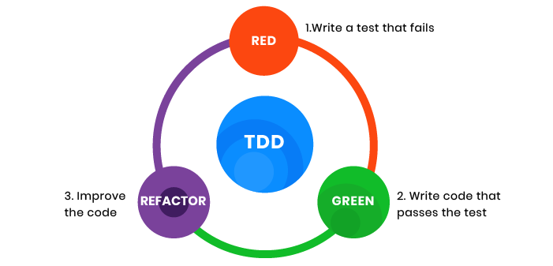

# Math Series [PR Url (PR : Pull Request)](https://github.com/Faisal-Hawajreh/math-series/pull/1)

In this Repository, We create three functions and two to three tests for each one.

## Fibonacci function --> fibonacci(n)

    Fibonacci is a function that is responsible for determine the value of index (n) in the Fibonacci Series.
    Fibonacci Series, in which each number is the sum of the two preceding ones.
    The series commonly starts from 0 and 1
    The resulting series looks like this: 
    {0, 1, 1, 2, 3, 5, 8, 13, ...}

    Input : 
        n : Integer.
    
    Output :
        return value of index (n) in the Fibonacci Series.

## lucas function --> lucas(n)

    Lucas is a function that is responsible for determine the value of index (n) in the lucas Series.
    Lucas Series, in which each number is the sum of the two preceding ones.
    The Lucas Numbers are a related series of integers that start with the values 2 and 1 rather than 0 and 1. 
    The resulting series looks like this:
    {2, 1, 3, 4, 7, 11, 18, 29, ...}

    Input : 
        n : Integer.
    
    Output :
        return value of index (n) in the Lucas Series.

## sum_series function --> sum_series(n,idx_0 = 0 ,idx_1 = 1)

    Sum Series is a function that is responsible for determine the value of index (n) in the Sum Series.
    Sum Series, in which each number is the sum of the two preceding ones.

    Sum Series function has one required parameter and two optional parameters.
    The required parameter (n) will determine which element in the series to print.
    The two optional parameters (idx_0,idx_1) will have default values of (idx_0 = 0) and (idx_1 = 1) and will determine the first two values for the series to be produced.
    Calling this function with no optional parameters will produce numbers from the fibonacci series.
    Calling it with the optional arguments (idx_0 = 2) and (idx_1 = 1) will produce values from the lucas numbers.
    Other values for the optional parameters will produce other series.
    
    The resulting series looks like this: 
    Fibonacci Series: {0, 1, 1, 2, 3, 5, 8, 13, ...}
    Lucas Series : {2, 1, 3, 4, 7, 11, 18, 29, ...}

    Input : 
        n : Integer. (Required)
        idx_0 : Integer. (Optional)
        idx_1 : Integer. (Optional)
    Output :
        return value of index (n) in the Fibonacci,Lucas or other Series.(depending on idx_0 and idx_1 values )

## Some Important Terminal Codes
- python file_name.py --> a simple invocation of a script
- pytest  --> [PyTest Tutorial](https://www.guru99.com/pytest-tutorial.html)
- poetry --> [Poetry Commands](https://python-poetry.org/docs/cli/)
    - poetry new Project_name
    - poetry shell ,and exit
    - poetry install
- pyenv  --> [pyenv Tutorial](https://amaral.northwestern.edu/resources/guides/pyenv-tutorial)
    - pyenv  --version
    - pyenv global
    - pyenv local
- help(function_name)

## Test-driven development (TDD)
Test-driven development (TDD) is a software development process relying on software requirements being converted to test cases before software is fully developed, and tracking all software development by repeatedly testing the software against all test cases.

